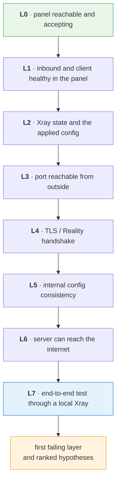

<div align="center">

# reality-check

**Diagnose and repair VPN servers running the 3x-ui panel on top of Xray**

[](https://www.python.org/)
[](https://github.com/MHSanaei/3x-ui)
[](https://github.com/XTLS/Xray-core)
[](#safety)

[Русский](README.md) · English

</div>

---

The panel returns `success: true`, the inbound is enabled, the client is active, the port is open — and the config still doesn't work. Sound familiar?

The panel reports the state of **its own database**, not what is actually happening inside Xray and on the network. Those two pictures diverge more often than you would expect. `reality-check` finds where they diverge, and proves a config works by making a real request through the tunnel.

```console
$ reality-check diag de-1 --inbound 1 --email alice

  OK   L0 panel reachable and accepts us: responding, auth: bearer
  OK   L1 inbound and client healthy in the panel: active, no limits hit
  FAIL L2 Xray on the server: the client copy inside the inbound is stale — the
          link from the panel will not work; the live identifier lives in the
          client table
  OK   L3 inbound port reachable from outside: port 443 accepts connections (49.5 ms)
  OK   L4 TLS/Reality handshake and its parameters: handshake completes
  OK   L5 internal config consistency: protocol, transport and flow agree
  FAIL L7 end-to-end test through a local Xray: FAIL

First failing layer: L2
```

Everything green except one line — and that line names the cause. Without it, this looks like "the network is acting up".

---

## Two principles

**Proof, not assumption.** "The panel returned 200" means nothing. The only honest check is to start a local Xray client with that exact config, make a request through it, and compare the exit IP with the server address.

```console
$ reality-check test de-2 443 alice

PASS  de-2 #3 (vless/tcp/reality) client=alice
  connectivity: ok 204 in 445.8 ms
  exit IP: 203.0.113.10 (matches the server)
```

**Localisation, not guesswork.** When something breaks, the diagnosis walks top-down and at every layer compares the view from outside with the view from inside. The guilty layer is the one where those two views disagree: "listening from inside, unreachable from outside" is filtering, not a broken Xray.



| Layer | What it checks | Typical verdict on failure |
|:--:|---|---|
| **L0** | panel reachable and accepting | wrong `base_path`, expired token, panel is down |
| **L1** | inbound and client healthy in the panel | disabled, expired, quota exhausted, port conflict |
| **L2** | Xray state and the applied config | Xray never started, port missing from the config, stale client copies |
| **L3** | port reachable from outside | provider firewall, Xray not listening |
| **L4** | TLS/Reality handshake | masking target unreachable, wrong SNI, mismatched key pair |
| **L5** | internal config consistency | `flow` incompatible with the transport, Reality on an unsupported transport |
| **L6** | server can reach the internet | no DNS, outbound traffic blocked |
| **L7** | end-to-end test | the final proof: it works or it doesn't |

> [!NOTE]
> **SSH is optional.** Xray state, the applied config and the logs all come from the panel API, and Reality key pairs are derived locally — both investigations below would have been solved without server access. SSH adds the systemd journal, the firewall, the list of listening sockets and the outbound traffic check.

---

## What it has already found in production

Both cases were investigated with this tool and confirmed by an end-to-end test. Full write-ups live in **[docs/cases.md](docs/cases.md)** (Russian).

<table>
<tr><td width="50%" valign="top">

### 🕵️ "The configs don't work"

...on a server that is entirely healthy.

The panel was handing out dead links. In the 3.x branch a client is a first-class entity, while the inbound stores a *copy* of it — and those copies had gone stale. Xray was running on the correct value; `inbounds/allLinks` served the stale one.

The symptom is deceptive: `UNEXPECTED_EOF` with TCP and TLS both green. Reality does not recognise the client, so it silently forwards the handshake to the masking site — the client gets no rejection, just silence.

</td><td width="50%" valign="top">

### 💥 "Nothing works at all"

One inbound had been created as `httpupgrade + reality` — a combination Xray does not accept.

Xray loads its config as a whole, so it rejected the file **together with the healthy inbounds** and never started. The inbound on port 443 with 4.8 GB of traffic died the moment a broken neighbour with zero traffic appeared next to it.

Disabling that single inbound brought the server back.

</td></tr>
</table>

---

## Landed here with an error?

The exact strings people paste into a search box, and what actually stands behind them:

| What you see | Where to look |
|---|---|
| `SSLEOFError` · `UNEXPECTED_EOF_WHILE_READING` while TCP and TLS are both fine | Reality does not recognise the client and forwards the handshake to the masking site — a stale client copy, or a mismatched key pair |
| `REALITY only supports RAW, XHTTP and gRPC for now` | an incompatible transport brings down the **entire** config |
| `Failure in running xray-core: exit status 23` | Xray rejected the config and never started; the reason is one line above in the journal |
| `failed to build inbound config with tag …` | the tag names the guilty inbound |
| the panel returns `success: true` but the config does not work | [troubleshooting tree](docs/troubleshooting.md) |

Both first two cases are dissected in [docs/cases.md](docs/cases.md).

---

## Quick start

```bash
git clone https://github.com/elysosss/reality-check && cd reality-check
python -m venv .venv
```

<table><tr><td>

**Linux / macOS**

```bash
source .venv/bin/activate
pip install -e .
```

</td><td>

**Windows**

```powershell
.venv\Scripts\Activate.ps1
pip install -e .
```

</td></tr></table>

```bash
cp config/servers.example.yaml config/servers.yaml    # then fill it in
reality-check fetch-xray                              # local xray used by the checks
```

Everything also works without installing, as `python -m reality_check <command>`.

`config/servers.yaml` is git-ignored. Secrets may live in the environment instead: `api_token: "${ENV:DE1_TOKEN}"`.

A normal working loop:

```bash
reality-check probe                    # what each panel supports
reality-check inventory                # every inbound across every server
reality-check test de-1 443 vasya      # does the config actually work
reality-check diag de-1 --inbound 443 --email vasya   # if it doesn't
```

---

## Commands

**Read-only and diagnostic** — these change nothing:

| Command | What it does |
|---|---|
| `probe [server…]` | fingerprint the panels: version, auth mode, live endpoints, OpenAPI → `runs/caps/` |
| `inventory [server…]` | every inbound: scheme, port, node, connection address, traffic |
| `test <server> <inbound> <email>` | end-to-end check: local xray → SOCKS5 → exit IP comparison |
| `diag [server…] [--inbound N --email X]` | layered L0…L7 diagnosis with ranked hypotheses |
| `drift [server…]` | stale client copies and mismatched Reality key pairs |
| `clients <server> <inbound>` | clients of an inbound; flags the ones whose copy is stale |
| `link <server> <inbound> <email>` | share link built from the client table identifier |
| `servers` · `ssh-check` · `fetch-xray` | configured servers · SSH access check · one-off xray-core download |

**Mutating** — dry-run by default, applied only with `--apply`:

| Command | What it does |
|---|---|
| `add-client <server> <inbound> --email X [--days N --gb N --limit-ip N]` | grant access |
| `del-client <server> <inbound> <email>` | revoke access |
| `clone-inbound <server> --from <inbound> --port N --remark X` | new inbound modelled on a working one |
| `inbound-enable <server> <id> [--off]` | enable or disable an inbound |
| `fix-drift <server>` | refresh stale client copies inside inbounds |

An inbound can be referenced either by `id` or by `remark`.

---

## How it works

Panel versions differ in which endpoints they expose, so nothing is hardcoded: `probe` interrogates the panel, locates its OpenAPI document and caches the capabilities in `runs/caps/<server>.json`, while server calls try known path layouts in turn. New inbounds are created by cloning a known-good one rather than assembling a scheme from scratch.

Multi-node panels are supported: an inbound carrying a `nodeId` runs on a node rather than on the panel host, so checks are aimed at the node address — otherwise the diagnosis is simply wrong.

## Safety

> [!IMPORTANT]
> This tool operates on production servers, so caution is built into it rather than left to discipline.

- `config/servers.yaml` is git-ignored; secrets are masked in output and scrubbed from artifacts. Reality private keys are never logged.
- Diagnosis changes nothing: only **read-only commands** are executed over SSH, and the allowlist lives in [reality_check/diag/ssh.py](reality_check/diag/ssh.py).
- Mutating commands print what *would* be sent and require `--apply`.
- A snapshot is written to `runs/snapshots/` before any change.
- Bulk panel operations (`resetAllTraffics`, `bulkDel`) are never called.

## Layout

```
reality_check/api/    panel access: transport, models, inbounds, clients,
                      client table, nodes, links, capability probing
reality_check/diag/   network probes, SSH, host state, drift detection,
                      end-to-end test, layered triage
docs/                 investigations, API map, troubleshooting tree
runs/                 run artifacts: probes, inventory, snapshots (git-ignored)
tools/                local xray-core (git-ignored)
```

## Documentation

Written in Russian.

| | |
|---|---|
| **[Investigations](docs/cases.md)** | two real cases, from the complaint to the fix |
| **[Troubleshooting tree](docs/troubleshooting.md)** | symptom → cause → check, layer by layer |
| **[Panel API map](docs/api-map.md)** | endpoints, formats and the pitfalls of the 3.x branch |
| **[Working rules](CLAUDE.md)** | repository invariants, for agents and humans alike |
