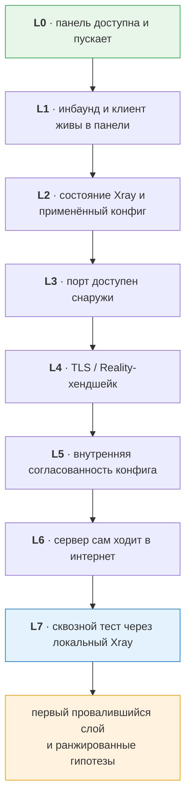

<div align="center">

# reality-check

**Диагностика и починка VPN на серверах с панелью 3x-ui поверх Xray**

[](https://www.python.org/)
[](https://github.com/MHSanaei/3x-ui)
[](https://github.com/XTLS/Xray-core)
[](#безопасность)

Русский · [English](README.en.md)

</div>

---

Панель отвечает `success: true`, инбаунд включён, клиент активен, порт открыт — а конфиг не работает. Знакомо?

Панель сообщает о состоянии **своей базы**, а не о том, что происходит в Xray и в сети. Эти две картины расходятся чаще, чем кажется. `reality-check` находит место расхождения и доказывает работоспособность реальным запросом через туннель.

```console
$ reality-check diag de-1 --inbound 1 --email alice

  OK   L0 панель 3x-ui доступна и пускает: панель отвечает, авторизация: bearer
  OK   L1 инбаунд и клиент в панели в рабочем состоянии: активны, лимиты не выбраны
  FAIL L2 Xray на сервере: копия клиента в инбаунде устарела — ссылка из панели
          работать не будет, рабочий идентификатор берётся из таблицы клиентов
  OK   L3 порт инбаунда доступен снаружи: порт 443 принимает соединения (49.5 мс)
  OK   L4 TLS/Reality-хендшейк и его параметры: хендшейк проходит
  OK   L5 внутренняя согласованность конфига: протокол, транспорт и flow согласованы
  FAIL L7 сквозной тест через локальный Xray: FAIL

Первый провалившийся слой: L2
```

Всё зелёное, кроме одной строки — и она называет причину. Без неё это выглядело бы как «сеть барахлит».

---

## Два принципа

**Доказательство вместо предположения.** «Панель ответила 200» ничего не значит. Единственная честная проверка — поднять локальный xray-клиент с этим конфигом, сходить через него в сеть и сверить внешний IP с адресом сервера.

```console
$ reality-check test de-2 443 alice

PASS  de-2 #3 (vless/tcp/reality) клиент=alice
  проходимость: ok 204 за 445.8 мс
  внешний IP: 203.0.113.10 (совпадает с сервером)
```

**Локализация вместо гадания.** Когда не работает, диагностика идёт сверху вниз и на каждом слое сравнивает взгляд снаружи со взглядом изнутри. Виноват тот слой, где эти два взгляда расходятся: «изнутри слушает, снаружи не достучаться» — это фильтрация, а не сломанный Xray.



| Слой | Что проверяет | Типичный вывод при провале |
|:--:|---|---|
| **L0** | панель доступна и пускает | не тот `base_path`, протухший токен, панель лежит |
| **L1** | инбаунд и клиент в панели живы | выключен, истёк срок, выбран лимит, конфликт портов |
| **L2** | состояние Xray и применённый конфиг | Xray не стартовал, порт не доехал до конфига, устаревшие копии клиентов |
| **L3** | порт доступен снаружи | фаервол провайдера, Xray не слушает |
| **L4** | TLS/Reality-хендшейк | недоступен сайт-маскировка, не тот SNI, разъехалась пара ключей |
| **L5** | внутренняя согласованность конфига | `flow` несовместим с транспортом, Reality с неподдерживаемым транспортом |
| **L6** | сервер сам ходит в интернет | нет DNS, заблокирован исходящий трафик |
| **L7** | сквозной тест | итоговое доказательство: работает или нет |

> [!NOTE]
> **SSH не обязателен.** Состояние Xray, применённый конфиг и логи панель отдаёт через API, а пары ключей Reality считаются локально — обе разобранные ниже поломки нашлись бы и без доступа к серверу. SSH добавляет журнал systemd, фаервол, список слушающих портов и проверку исходящего трафика.

---

## Что уже нашлось на боевых серверах

Оба случая разобраны этим инструментом и подтверждены сквозным тестом. Подробный разбор — в **[docs/cases.md](docs/cases.md)**.

<table>
<tr><td width="50%" valign="top">

### 🕵️ «Конфиги не работают»

...при полностью исправном сервере.

Панель раздавала мёртвые ссылки: в ветке 3.x клиент — самостоятельная сущность, а внутри инбаунда лежит его копия, и копии устарели. Xray работал по верному значению, `inbounds/allLinks` отдавал устаревшее.

Симптом обманчив: `UNEXPECTED_EOF` при зелёных TCP и TLS. Reality не узнаёт клиента и молча уводит хендшейк на сайт-маскировку — отказа клиент не получает, получает тишину.

</td><td width="50%" valign="top">

### 💥 «Не работает вообще ничего»

Один инбаунд был создан как `httpupgrade + reality` — сочетание, которого Xray не принимает.

Xray загружает конфиг целиком, поэтому отверг файл **вместе с исправными инбаундами** и не стартовал вовсе. Инбаунд на 443 с трафиком 4.8 ГБ умер в тот момент, когда рядом появился некорректный сосед с нулевым трафиком.

Выключение одного инбаунда вернуло сервер к жизни.

</td></tr>
</table>

---

## Если вы пришли сюда с ошибкой

Дословные строки, за которыми обычно стоит вполне конкретная причина:

| Что видно | Где смотреть |
|---|---|
| `SSLEOFError` · `UNEXPECTED_EOF_WHILE_READING` при живых TCP и TLS | Reality не узнаёт клиента и уводит хендшейк на сайт-маскировку — [устаревшая копия клиента](docs/cases.md#случай-1-конфиги-не-работают-хотя-сервер-полностью-исправен) либо разъехавшаяся пара ключей |
| `REALITY only supports RAW, XHTTP and gRPC for now` | несовместимый транспорт роняет **весь** конфиг — [случай 2](docs/cases.md#случай-2-не-работает-вообще-ничего) |
| `Failure in running xray-core: exit status 23` | Xray отверг конфиг и не стартовал; причина строкой выше в журнале |
| `failed to build inbound config with tag …` | тег назовёт виновный инбаунд |
| панель отвечает `success: true`, а конфиг не работает | [дерево неисправностей](docs/troubleshooting.md) |

---

## Быстрый старт

```bash
git clone https://github.com/elysosss/reality-check && cd reality-check
python -m venv .venv
```

<table><tr><td>

**Linux / macOS**

```bash
source .venv/bin/activate
pip install -e .
```

</td><td>

**Windows**

```powershell
.venv\Scripts\Activate.ps1
pip install -e .
```

</td></tr></table>

```bash
cp config/servers.example.yaml config/servers.yaml    # и заполнить
reality-check fetch-xray                              # локальный xray для проверок
```

Без установки всё то же работает как `python -m reality_check <команда>`.

`config/servers.yaml` не попадает в git. Секреты можно держать в окружении: `api_token: "${ENV:DE1_TOKEN}"`.

Обычный порядок работы:

```bash
reality-check probe                    # что умеет каждая панель
reality-check inventory                # все инбаунды всех серверов
reality-check test de-1 443 vasya      # работает ли конфиг на самом деле
reality-check diag de-1 --inbound 443 --email vasya   # если не работает
```

---

## Команды

**Чтение и диагностика** — ничего не меняют:

| Команда | Что делает |
|---|---|
| `probe [сервер…]` | прощупать панели: версия, авторизация, живые эндпоинты, OpenAPI → `runs/caps/` |
| `inventory [сервер…]` | все инбаунды: схема, порт, узел, адрес подключения, трафик |
| `test <сервер> <инбаунд> <email>` | сквозная проверка: локальный xray → SOCKS5 → сверка внешнего IP |
| `diag [сервер…] [--inbound N --email X]` | послойная диагностика L0…L7 с гипотезами |
| `drift [сервер…]` | устаревшие копии клиентов и разъехавшиеся пары ключей Reality |
| `clients <сервер> <инбаунд>` | клиенты инбаунда; помечает тех, чья копия устарела |
| `link <сервер> <инбаунд> <email>` | share-ссылка с идентификатором из таблицы клиентов |
| `servers` · `ssh-check` · `fetch-xray` | список серверов · проверка SSH · разовая загрузка xray-core |

**Изменения** — по умолчанию dry-run, применяют только с `--apply`:

| Команда | Что делает |
|---|---|
| `add-client <сервер> <инбаунд> --email X [--days N --gb N --limit-ip N]` | выдать доступ |
| `del-client <сервер> <инбаунд> <email>` | забрать доступ |
| `clone-inbound <сервер> --from <инбаунд> --port N --remark X` | новый инбаунд по образцу рабочего |
| `inbound-enable <сервер> <id> [--off]` | включить/выключить инбаунд |
| `fix-drift <сервер>` | освежить копии клиентов в инбаундах |

Инбаунд указывается и по `id`, и по `remark`.

---

## Как это устроено

Панели разных версий отличаются набором эндпоинтов, поэтому ничего не хардкодится: `probe` опрашивает панель, находит её OpenAPI и складывает возможности в `runs/caps/<сервер>.json`, а серверные вызовы сами перебирают известные раскладки путей. Новые инбаунды создаются клонированием заведомо рабочего, а не сборкой схемы с нуля.

Поддерживаются мультинодовые панели: инбаунд с `nodeId` поднят не на хосте панели, и проверки идут по адресу узла — иначе диагноз ложный.

## Безопасность

> [!IMPORTANT]
> Инструмент работает с боевыми серверами, поэтому осторожность встроена в него, а не оставлена на дисциплину.

- `config/servers.yaml` в `.gitignore`; в выводе секреты маскируются, в артефактах — вычищаются. Приватные ключи Reality не логируются.
- Диагностика ничего не меняет: по SSH выполняются **только читающие команды**, список — в [reality_check/diag/ssh.py](reality_check/diag/ssh.py).
- Изменяющие команды по умолчанию показывают, что было бы отправлено, и требуют `--apply`.
- Перед изменениями сохраняется снапшот в `runs/snapshots/`.
- Массовые операции панели (`resetAllTraffics`, `bulkDel`) не вызываются.

## Структура

```
reality_check/api/    работа с панелью: транспорт, модели, инбаунды, клиенты,
                      таблица клиентов, узлы, ссылки, проба возможностей
reality_check/diag/   сетевые пробы, SSH, состояние хоста, расхождения,
                      сквозной тест, послойный триаж
docs/                 разобранные случаи, карта API, дерево неисправностей
runs/                 артефакты прогонов: пробы, инвентарь, снапшоты (не в git)
tools/                локальный xray-core (не в git)
```

## Документация

| | |
|---|---|
| **[Разобранные случаи](docs/cases.md)** | два настоящих расследования от жалобы до починки |
| **[Дерево неисправностей](docs/troubleshooting.md)** | признак → причина → проверка, по слоям |
| **[Карта API панелей](docs/api-map.md)** | эндпоинты, форматы, грабли ветки 3.x |
| **[Правила работы](CLAUDE.md)** | инварианты репозитория для агента и человека |
